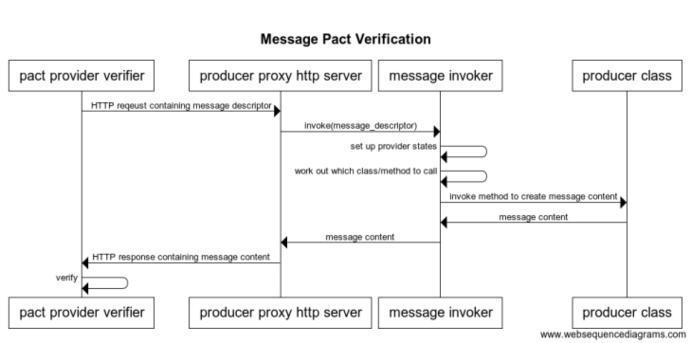
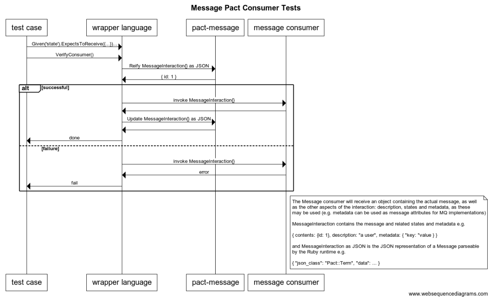

# Finally. A Message Pact Demo.

About time, hey?

Here is some background https://gist.github.com/bethesque/c858e5c15649ae525ef0cc5264b8477c

## TODO

* Document the consumer side.
* Fully define the checklist for the pact-message wrapper implementor
* Fully implement v3 pact specification.
    * What's done:
        * Supports the new matching rules location in the JSON document
        * Supports providerStates array object (used to be a single providerState string)
    * Limitations:
        * Only supports one provider state object in the array
        * Does not yet support provider state params
        * Does not support any of the new matching rules introduced in v3

## How it works - producer side

Technically, message pact has nothing to do with HTTP, but to allow us to reuse the existing pact-provider-verifier code, and to create a langauge agnostic interface that allows the producer verification code to be written in the language of the producer itself, an HTTP producer proxy will need to be created by the pact-message author for each language.

The payload that will be sent to the HTTP Proxy is:

```
{
  description: "description",
  providerStates: [{
    name: "name",
    params: {}
  }]
}
```



## How it works - consumer side

1. Test case sets up the interaction, and accepts a message consumer that should be able to handle the message
1. Test case invokes Verify on the wrapper language
1. Wrapper may optionally reach out to `pact-message` to `reify` the data structure back into its generated form (i.e. strip out all of the matchers etc.)
1. Wrapper then invokes the message consumer
1. If the consumer errors, it fails the test
1. If the consumer passes, it calls `pact-message update` to save the pact.



## Usage of this demo

One message will pass, another will fail with the wrong content, another will fail because it can't find the producer method to call, and another will fail because it can't set up the provider state.

    script/install.sh
    script/verify-with-standalone.sh

## What the pact-message wrapper implementer needs to do

* [ ] Create a DSL for creating/testing the messages in the consumer codebase, and writing the pact.
* [ ] Create a producer proxy for the producer verification
* [ ] Create a nice interface for allowing the produce team to wire up their producer code to the producer proxy (hiding the fact that http is even involved).
