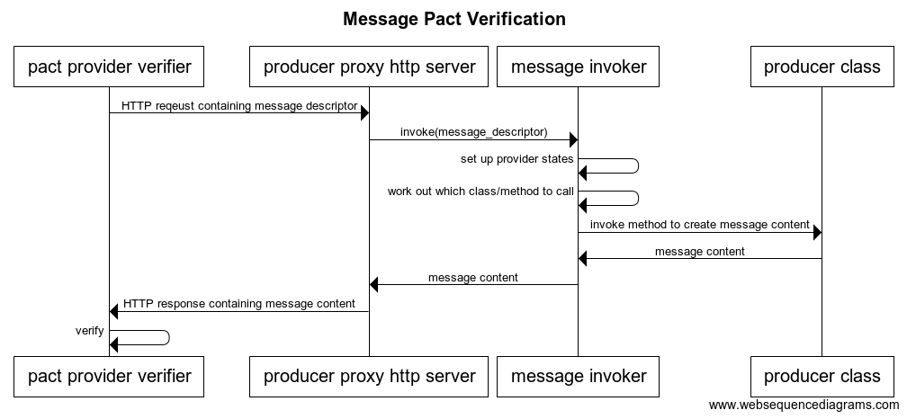

# Finally. A Message Pact Demo.

About time, hey?

## TODO

* Document the consumer side.
* Fully implement v3 pact specification.
    * What's done:
        * Supports the new matching rules location in the JSON document
        * Supports providerStates array object (used to be a single providerState string)
    * Limitations:
        * Only supports one provider state object in the array
        * Does not yet support provider state params
        * Does not support any of the new matching rules introduced in v3

## How it works - producer side

Technically, message pact has nothing to do with HTTP, but to allow us to reuse the existing pact-provider-verifier code, and to create a langauge agnostic interface that allows the producer verification code to be written in the language of the producer itself, an HTTP producer proxy will need to be created by the pact-message author for each language.

## Usage

One message will pass, another will fail with the wrong content, another will fail because it can't find the producer method to call, and another will fail because it can't set up the provider state.

    script/install.sh
    script/verify-with-standalone.sh
